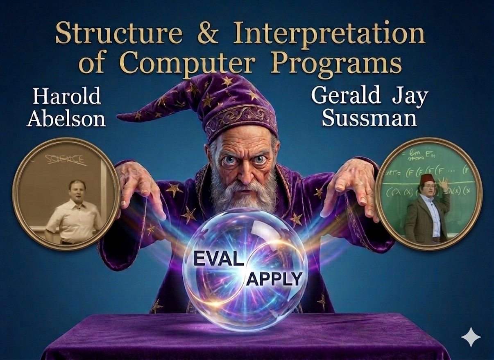

# 📚 Structure and Interpretation of Computer Programs (SICP)

> "Computer science is not about machines, in the same way that astronomy is not about telescopes." — *Hal Abelson*

Welcome to my repository for the **"CS Bible."** This project is a dedicated 18-month journey to master the foundational principles of computer science by solving every problem within the text.

---

### 🖼️ Project Memory
<div align="center">
  
  <p><i>My journey begins here.</i></p>
</div>

---

### 📅 Timeline
I am committed to a rigorous schedule to ensure deep understanding while balancing other concurrent projects.

* **Start Date:** 25 April 2026
* **Target Completion:** 25 October 2027
* **Total Duration:** 18 Months

---

### ⚙️ Development Environment
To maintain fidelity with the textbook, all solutions are implemented using **Racket** with the official `sicp` package.

**Installation:**
Run the following command in your terminal to install the SICP language definition:
```bash
raco pkg install sicp
